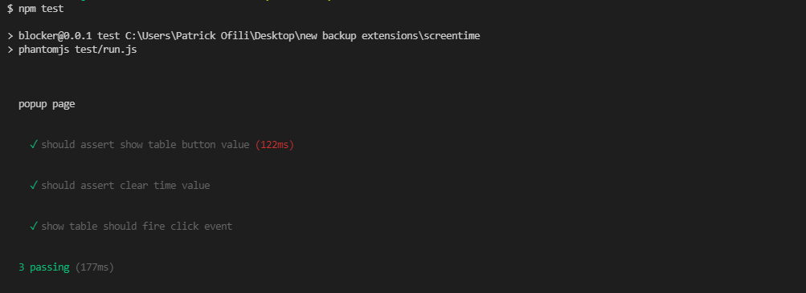

<div align="center">
  
</div>

<br /><br />
# DevAssist
DevAssist helps developers to increase thier productivity while prgramming and development. It is a portal whcih provides different tools to the developers which can help significantly in easing thier work and increasing efficiency too.

           


 <p align="center">
  <a href="#how-to-use">How To Use</a> •
  <a href="#features">Features</a> •
  <a href="#team">Team</a>
</p>

## Inspiration
Often times, Developers face a lot of challenges while building products which slows down their productivity. **DevAssist**  comes in to help these amazing developers with tools that help make their jobs a lot easier enabling them to focus on more  productive work without doing a lot of repititive tasks. 


## How we built it
   


- **API**: StackOverflow API, Twilio
- **Frontend**: HTML/CSS (Bootstrap), Javascript
- **Backend**:Flask ,Python
- **Version Control**: Git and GitHub
- **Web Hosting**: Heroku, .Tech

## How To Use The Application
To clone and run this application, you'll need [Git](https://git-scm.com) and [Python 3x](https://realpython.com/installing-python/) installed on your computer. From your command line:

```bash
# Clone this repository
$ git clone https://github.com/MLH-Fellowship/pod-3.1.0-DevAssist.git

# Go into the repository
$ cd pod-3.1.0-DevAssist

# Install dependencies
$ pip install -r requirements.txt

# Run the app
$ py app.py
```
## Features
<details><summary>Auto Error Checker </summary>
<p>It is boring and time-taking when there are too many errors in the code and you have to debug each and every error one by one.This feature eases the process a lot. It allows user to upload the file and displays all the errors in the code along with automatically opening the StackOverflow solution blogs for those corresponding errors in the browser itself.</p>
  
  
* Steps to use the feature
   * * Rename the file as "test.py" for which you want to check the errors.
   * * Upload the "test.py" file using the Choose file button.
   * * Lastly click on the SUBMIT button and you are ready to go!!

</details>

---

<details><summary>Website Blocker (Chrome Extension)</summary>
<p>Developers often spend a lot of time on the internet and sometimes we end up wasting our time instead of focusing on the task,we actually opened the browser for.This feature helps to improve the productivity of developers by keeping track of his/her website visits and also potentially blocking time-wasting or distracting websites which user wants.</p>
  
  
* Steps to use the extension
  * * Download the zip file and extract the extension.
  * * Go to the extensions page in Google Chrome under more options.
  * * Select Developer Mode and click on Load Unpacked.
  * * Navigate to the extracted extension folder and select it.
  * * Right click on the extension and select options to access the main options page.
  * * To block a webisite, type into the input and click on Add.
  * * To unblock select the Delete option in the list of blocked websites.

  
* Testing the extension<br>
  Test description: added test to assert UI elements and actions.
  

</details>

---

<details><summary>Website Monitor (Chrome Extension)</summary>
<p>Spending too much time infront of the screen affects developer's health a lot.This feature monitors the time spent by the user at different websites while recording the screentime and allows user to set the time-interval after which he wants to be alerted to take a break from screen, inorder to maintain balance between health and work.</p>

  
  
* Steps to use the extension
  * * Download the zip file and extract the extension.
  * * Go to the extensions page in Google Chrome under more options.
  * * Select Developer Mode and click on Load Unpacked.
  * * Navigate to the extracted extension folder and select it.
  * * Right click on the extension and select options to access the main options page.
  * * To block a webisite, type into the input and click on Add.
  * * To unblock select the Delete option in the list of blocked websites.

  
* Testing the extension<br>
  Test description: added test to assert UI elements and actions.
  


</details>

---

<details><summary>Developer Chat</summary>
Developers Chat Room feature of DEVASSIST provides a platform for live group chating with developers to share their thoughts. Now you don't have to wait for the answer solutions after posting doubts on stackOverflow, just drop a message in the chat room and get to discuss it instantly with others.
  <br>
  Now you don't have to wait for the answer solutions after posting doubts on stackOverflow, just drop a message in the chat room and get to discuss it instantly with others.

</details>

---

<details><summary>Boilerplate Generator</summary>
 <p>It is a tedious task of writing code for full stack appliaction from scratch. Use these boilerplates for your next web application !!</p>

  
  * Steps to use the boilerplate
    * * Firstly, download [Docker desktop](https://www.docker.com/products/docker-desktop) and follow its instructions to install it. This allows us to start using Docker containers.
    * * Then run <br>
        ```
        docker-compose build
        ```
        This spins up Compose and builds a local development environment according to our specifications in [docker-compose.yml](docker-compose.yml). 
    * * After the containers have been built (this may take a few minutes), run <br>
        ```
        docker-compose up
        ``` 
        This one command boots up a local server.
    * * Now Head over to indicated localhost ports in the respective Readme to see the frontend and backend running.
    * * Finally, to gracefully stop running our local servers, you can run <br>
        ```
        docker-compose down
        ``` 
        in a separate terminal window.
 
</details>

---

<details><summary>Battery Reminder</summary>
 <p>As a laptop user you must take caution about your battery because the battery is also the most important component If you are using an old laptop then you might be a wonder to protect your battery from getting overcharged! This Battery Reminder feature helps you to get varoius notifications (like desktop, SMS, notifications and even voice reminders), when your laptop get 100% charged and your charger is still plugged in.</p>
  
  * Steps to use the script
    * * Download the zip file and extract the script.
    * * Install the dependencies using the requirements.txt file.
    * * Create a free ttrial Twilio Account if you want to get sms notifications.
    * * Add your Twilio account credentials in the script(wherever mentioned).
    * * You can run the script(batteryReminder.pyw) in the background whenever you plug in your charge Or you can simply paste the it in startup folder so that everytime you open your laptop, this script starts running automatically.
</details>

---

 

 
## MLH Pre-Fellowship(Summer 2021)

> This is a hackathon project made by MLH Fellows - Pod 3.1.0 i.e. Recursive Rhinos - Team 3


## Team

> "Alone we can do so little; together we can do so much."

| S.No. | Name               | Role               | GitHub Username:octocat:                             |
| ----- | ------------------ | ------------------ | ---------------------------------------------------- |
| 1.    | Patrick Ofili | Sofware Engineer  | [@OfiliPatrick](https://github.com/OfiliPatrick)           |
| 2.    | Nilisha Jaiswal      | Sofware Developer | [@nilisha-jais](https://github.com/nilisha-jais) |
| 3.    | Johnpaul Ugwulo  | Sofware Engineer | [@ugwulo](https://github.com/ugwulo) |
| 4.    | Simran Singh  | Sofware Developer | [@simran1199](https://github.com/simran1199) |


<br>
<br>

## Contributors ✨

Thanks goes to these wonderful people ([emoji key](https://allcontributors.org/docs/en/emoji-key)):

<!-- ALL-CONTRIBUTORS-LIST:START - Do not remove or modify this section -->
<!-- prettier-ignore-start -->
<!-- markdownlint-disable -->
<table>
  <tbody><tr>
            <td align="center"><a href="https://www.linkedin.com/in/patrick-ofili-65056317a/"><br><sub><b>Patrick Ofili</b></sub></a><br><a href="https://github.com/MLH-Fellowship/pod-3.1.0-DevAssist/commits?author=OfiliPatrick" title="Code">💻</a></td>
    <td align="center"><a href="https://nilisha-jais.github.io/portfolio/"><br><sub><b>Nilisha Jaiswal</b></sub></a><br><a href="https://github.com/MLH-Fellowship/pod-3.1.0-DevAssist/commits?author=nilisha-jais" title="Code">💻</a></td>
            <td align="center"><a href="https://www.linkedin.com/in/ugwulo"><br><sub><b>Johnpaul Ugwulo</b></sub></a><br><a href="https://github.com/MLH-Fellowship/pod-3.1.0-DevAssist/commits?author=ugwulo" title="Code">📖</a></td>
    <td align="center"><a href="https://www.linkedin.com/in/simran3579singh/"><br><sub><b>Simran Singh</b></sub></a><br><a href="https://github.com/MLH-Fellowship/pod-3.1.0-DevAssist/commits?author=simran1199" title="Code">💻</a></td>

  </tr>
</tbody></table>


---
